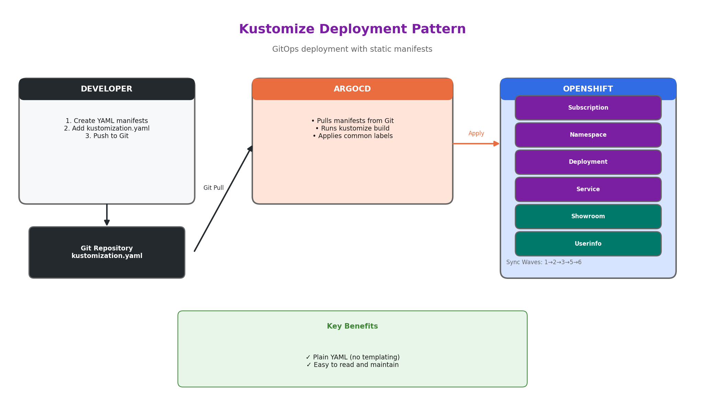

# Kustomize Example - Web Terminal with Sample Application and Showroom

This example demonstrates a multi-step Kustomize deployment that:
1. Installs the Web Terminal operator
2. Creates a demo namespace
3. Deploys a sample httpd application
4. Deploys Showroom lab guide
5. Creates RHDP userinfo ConfigMap



## What This Deploys

- **Web Terminal Operator** - Installed via OLM Subscription
- **Demo Namespace** - `terminal-demo` namespace for the sample application
- **Sample Application** - A simple httpd deployment you can access via the Web Terminal
- **Showroom Lab Guide** - Interactive lab instructions with embedded terminal (3 containers: nginx, content, terminal)
- **Userinfo ConfigMap** - RHDP integration with access instructions

## Quick Start

1. **Copy this folder** to your own Git repository
2. **Update Showroom content** - Edit `showroom/showroom.yaml` and update the Git repository URL:
   ```yaml
   - name: GIT_REPO_URL
     value: "https://github.com/YOUR-ORG/your-showroom-content.git"
   ```
3. **Push** to your Git repository
4. **Order** the Field Content CI from RHDP with deployment type `kustomize`

## File Structure

```
kustomize/
├── kustomization.yaml       # Main Kustomize configuration
├── subscription.yaml        # OLM Subscription (sync-wave 1)
├── namespace.yaml           # Demo namespace (sync-wave 2)
├── deployment.yaml          # Sample app deployment (sync-wave 3)
├── service.yaml             # Sample app service (sync-wave 3)
├── showroom/
│   ├── namespace.yaml       # Showroom namespace (sync-wave 5)
│   └── showroom.yaml        # Showroom deployment (sync-wave 5)
├── userinfo.yaml            # RHDP integration (sync-wave 6)
└── README.md                # This file
```

## How It Works

```
ArgoCD deploys resources in sync-wave order:

  Wave 1: Subscription (web-terminal operator)
     │
     ▼
  Wave 2: Namespace (terminal-demo)
     │
     ▼
  Wave 3: Deployment + Service (hello-world app)
     │
     ▼
  Wave 5: Showroom namespace + deployment
     │
     ▼
  Wave 6: Userinfo ConfigMap
```

After deployment:
1. Access the Showroom lab guide at `https://showroom.<cluster-domain>`
2. Follow the lab instructions
3. Use the embedded terminal or click the (>_) icon in the OpenShift console

## Showroom Configuration

To use your own lab guide content, edit `showroom/showroom.yaml` and update the Git repository URL in two places:

```yaml
# In the git-cloner init container
- name: GIT_REPO_URL
  value: "https://github.com/YOUR-ORG/your-showroom-content.git"

# In the content container
- name: GIT_REPO_URL
  value: "https://github.com/YOUR-ORG/your-showroom-content.git"
```

### Disable Showroom

To deploy without Showroom, remove the showroom entries from `kustomization.yaml`:
```yaml
resources:
  - subscription.yaml
  - namespace.yaml
  - deployment.yaml
  - service.yaml
  # - showroom/namespace.yaml   # Remove these
  # - showroom/showroom.yaml    # Remove these
  - userinfo.yaml
```

## Customization

### Change the Application

Edit `deployment.yaml` and `service.yaml` to deploy a different application.

### Deploy a Different Operator

Edit `subscription.yaml`:

```yaml
metadata:
  name: openshift-pipelines-operator-rh
spec:
  channel: latest
  name: openshift-pipelines-operator-rh
```

Update labels in `kustomization.yaml` and `userinfo.yaml` accordingly.

## Common Labels

The `kustomization.yaml` applies common labels to all resources:

```yaml
labels:
  - pairs:
      demo.redhat.com/application: web-terminal
    includeSelectors: false
```

## Testing Locally

```bash
# Preview what will be created
kustomize build .

# Apply to a cluster
kustomize build . | oc apply -f -

# Or use oc directly
oc apply -k .

# Check resources
oc get subscription -n openshift-operators web-terminal
oc get deployment -n terminal-demo hello-world
oc get deployment -n showroom showroom
```

## Comparison with Helm

| Feature | Kustomize | Helm |
|---------|-----------|------|
| Templating | No | Yes |
| Value substitution | No | Yes (`{{ .Values.x }}`) |
| Conditional resources | No | Yes (`{{- if }}`) |
| Learning curve | Lower | Higher |
| File format | Plain YAML | Go templates |

**Use Kustomize when:**
- Static manifests with no cluster-specific values
- You prefer plain YAML over templating
- Simple deployments

**Use Helm when:**
- You need different values per environment
- You need conditional logic
- You want parameterized charts

## Comparison with Ansible

| Feature | Kustomize | Ansible |
|---------|-----------|---------|
| Wait for resources | No (best effort) | Yes (guaranteed) |
| Multi-step workflows | Yes (sync waves) | Yes (sequential) |
| Error handling | No | Yes |
| Complexity | Low | Higher |

**Use Ansible when:**
- You need to wait for the operator to be ready before creating CRs
- You need guaranteed ordering (not just best effort)
- You have complex conditional logic based on cluster state
